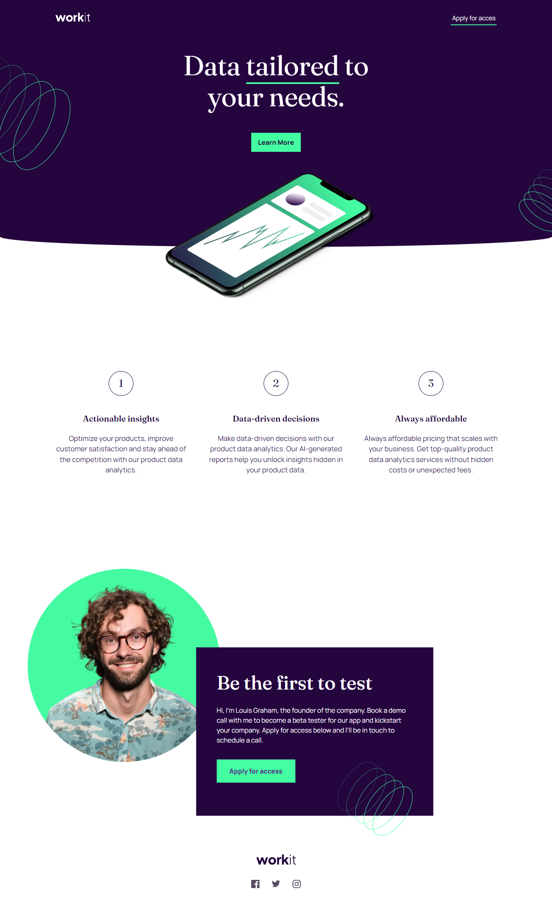

# pablodev - Workit landing page solution

#### NOTA EM PT-BR

Mais uma solução, é muito satisfatório sentir que em cada solução que completo, as minhas linhas se tornam mais fluidas e consizas, as vezes acho que me cobro demais. porém não posso parar aqui! 
🎆🔥❤️

 

This is a solution to the [Workit landing page challenge on Frontend Mentor](https://www.frontendmentor.io/challenges/workit-landing-page-2fYnyle5lu). Frontend Mentor challenges help you improve your coding skills by building realistic projects. 

### Screenshot

### Links

- Solution URL: [Add solution URL here](https://your-solution-url.com)
- Live Site URL: [Add live site URL here](https://your-live-site-url.com)

## My process

### What I learned

Hello guys! more one solution complete.

I managed to adapt better with the relative and absolute position in this code, but I thought I created too many lines of CSS (even trying to remove all possible redundancies)

### Continued development

I intend to continue my coding, especially in CSS and JS, I've been practicing and with practice I'm sure I'll reach excellence

### Useful resources

## Author

- Website - [pablodev](https://www.pabloteixeira.site)
- Frontend Mentor - [@pablodev](https://www.frontendmentor.io/profile/pabloodev)

